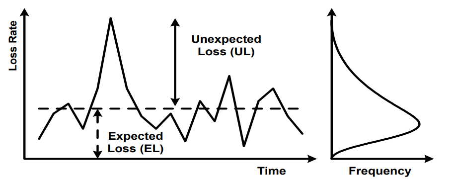
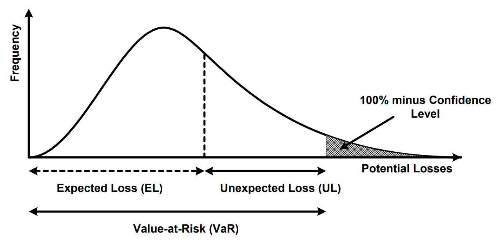

# Methodology

In the credit business, losses of interest and principal occur all the time, there are always some borrowers that do not meet their obligations. The losses that are actually experienced in a particular year vary from year to year.

It is impossible to know in advance the losses that a bank will suffer in a particular year. However, banks can measure the losses with an associated probability according to its experience (internal and external data). If banks have good models which allow to measure, know and understand the risk sources properly, they will be able to manage the risk through limits, pricing, hedges, diversification, securitizations and so on.

Peaks in the previous illustration are not frequent but when they occur, they can be very large, interest rates, including risk premia, charged on credit exposures may absorb some part of the unexpected losses, but market will not support prices sufficient to cover all of this unexpected losses. Therefore capital is needed to cover the risks of such peaks losses. It can be said that the capital has a loss-absorbing function.

The worst case once could image would be that banks lose their entire portfolio in a given year. This event, is highly unlikely, and holding capital to cover it would be economically inefficient. Banks have an incentive to minimize the capital they hold, because reducing capital frees up economic resources that can be directed to a more profitable investments. On the other hand, the less capital a bank holds, the greater is the likelihood that it will not be able to meet its own debt obligations. Thus, banks and their supervisors must carefully balance the risks and rewards of holding capital.

There are a number of approaches to obtain the credit loss distribution and then the risk managers can define the amount of loss which will be exceeded with a small pre-defined probability. Capital is set to ensure that unexpected losses that exceed this level have a low probability.

This document explains the methodology to obtain the credit loss distribution in the IDL model.

## Merton

In 1974, Merton proposed a method to evaluate the credit risk supported by a firm by taking equity return as a proxy for the assets return of the company observed.

Assuming that the dynamic of a firm assets follows a geometric Brownian motion, the evolution of the equity can be modeled and compared against the total level of the liabilities in the firms balance sheet after a given period.

$$ \\begin{aligned} dV_t & = \\mu_V V_t dt + \\sigma_V V_t dS_t & \\ V_0 & = V_0 \\end{aligned} $$

where,

-   $V_t$ denotes company’s equity value
-   $\\sigma_V$ denotes firm’s equity volatility
-   $\\sigma_V$ denotes the return rate of the firm’s equity
-   $dS_t$ denotes the standard Wiener process associated to the systematic risk $N(0, t)$

Some additional assumptions are needed in the above model, namely that there are no bankruptcy charges when default occurs, and debt and asset are single and liquid assets.

Two events can occur at maturity $t=T$:

1.The asset level is lower than the liabilities level. In this case the company is in bankruptcy the shareholders lose their investments, whereas the creditors share the remaining assets. 2. The asset level is higher than the liabilities level. In this case, the firm can reimburse the debt and shareholders may decide how to use the surplus.

In other words, according to Merton’s model, equity return can be considered as a vanilla option. The shareholders are long a call option on equities value with strike the level of the debt and maturity T. The premium is the value invested by the shareholders in the firm, whereas the debtors are short a put option on equities value with same strike and same maturity. The premium is the debt plus an interest rate.

<!-- -->

Here,

-   $Vt$ is the total value of the firms assets,
-   $D$ is the level of total liabilities,
-   red line is the payoff from the stakeholders point of view}$
-   blue line is the payoff from the debtors point of view}$

The GBM has for solution:

$$ V_t = V_0 \\cdot e^{\\left(\\mu_V - \\frac{1}{2} \\sigma_V \\right) t + \\sigma_V S_t} $$

## Vasicek

The Vasicek formula is basically comes from Merton model in the sense that under some assumptions mentioned earlier, the assets of borrowing firms can be modeled by companies equity as a stochastic differential equation. However, the difference between Merton model and Vasicek model is that in Vasiscek’s Model, instead of taking the liabilities level to infer the PD of a firm, here the PD is given and the debt level can be inferred from the PD. The advantage of doing this way is that the levels of both asset return and liabilities disappear from the formula and therefore simplifies the model.

As an example, we are going to derive the probability of default of a single firm taking into account the systematic risk and the idiosyncratic risk. From the Merton model the value of equity as following can be written:

$$ dV_t = \\mu_V V_t dt + \\sigma_V V_t dS_t + \\beta_V V_t dB_t $$

where,

-   $V_t$ denotes company’s equity value at time $t$,
-   $\\sigma_V$ denotes the sensitivity of the firm to systematic risk,
-   $\\mu_V$ denotes the return rate of the firm’s equity,
-   $\\beta_V$ denotes the sensibility of the firm to idiosyncratic risk.
-   $B_t$ denotes the standard Wiener process associated to the idiosyncratic risk $\\sim N(0,dt)$,
-   $dS_t$ denotes the standard Wiener process associated to the systematic risk $\\sim N(0,dt)$.

It is worth mentioning that $\\mu_V$, $\\sigma_V$ and $\\beta_V$ are estimated constants and that $dS_t$ and $dB_t$ are independent Wiener processes.

As in Equation 2 the solution to this stochastic differential equation can be rewritten as:

$$ V_t = V_0 \\cdot e ^ {\\mu_V t - \\frac{t}{2} (\\sigma_V^2 + \\beta_V^2) + \\begin{bmatrix} \\sigma_V & \\beta_V \\end{bmatrix} \\begin{bmatrix} dS_t \\ dB_t \\end{bmatrix} } $$

Taking a time horizon of one year, we can set $t=1$ and thus $S_1$ and $B_1$ follow a $N(0,1)$ distribution. The equation above can be simplified like:

$$ V_t = V_0 \\cdot e ^ {\\mu_V - \\frac{1}{2} (\\sigma_V^2 + \\beta_V^2) + \\begin{bmatrix} \\sigma_V & \\beta_V \\end{bmatrix} \\begin{bmatrix} dS_t \\ dB_t \\end{bmatrix} } $$

To model default events we introduce a new random variable D, which is assumed to be Bernoulli distributed: $B(PD)$,

$$ D = \\begin{cases} 0 & p(0) = (1 - PD) \\ 1 & p(1) = PD \\end{cases} $$

Here, $D=1$ means that default event has occurred. In other words, after a period of one year we observe that the level of $V_1$ stands below the level of liabilities (L), Thus we can write:

$$ PD = P\\left( V_0 \\cdot e ^ {\\mu_V - \\frac{1}{2} (\\sigma_V^2 + \\beta_V^2) + \\begin{bmatrix} \\sigma_V & \\beta_V \\end{bmatrix} \\begin{bmatrix} dS_t \\ dB_t \\end{bmatrix} } \< L\\right) $$

$$ PD = P\\left( \\mu_V - \\frac{1}{2} (\\sigma_V^2 + \\beta_V^2) + \\begin{bmatrix} \\sigma_V & \\beta_V \\end{bmatrix} \\begin{bmatrix} dS_t \\ dB_t \\end{bmatrix} \< ln \\frac{L}{V_0}\\right) $$

$$ PD = P\\left(\\begin{bmatrix} \\sigma_V & \\beta_V \\end{bmatrix} \\begin{bmatrix} dS_t \\ dB_t \\end{bmatrix} \< ln \\frac{L}{V_0} - \\mu_V + \\frac{1}{2} (\\sigma_V^2 + \\beta_V^2)\\right) $$

We know that $B_1$ and $S_1$ are independent and follows a $N(0,1)$ distribution. Furthermore, $sigma_V S_1 \\sim N(0, σ_V^2)$ and $\\beta_V B_1 \\sim N(0, \\beta_V^2)$, from which it is easy to find that $\\sigma_V S_1 + \\beta_V B_1 \\sim N(0, \\sigma_V^2 + \\beta_V^2)$. Now we can standardize the random variable in the right hand side of the inequality and we get that:

$$ PD = P\\left(\\frac{\\sigma_V S_1 + \\beta_V B_1}{\\sqrt{\\sigma_V^2 + \\beta_V^2}} \< \\frac{ln \\frac{L}{V_0} - \\mu_V + \\frac{1}{2} (\\sigma_V^2 + \\beta_V^2)} {\\sqrt{\\sigma_V2+\\beta_V2}}\\right) $$

$$ PD = \\Phi\\left(\\frac{ln \\frac{L}{V_0} - \\mu_V + \\frac{1}{2} (\\sigma_V^2 + \\beta_V^2)} {\\sqrt{\\sigma_V2+\\beta_V2}}\\right) $$

Now let $\\rho_V = \\frac{\\sigma_V2}{\\sigma_V2 + \\beta_V^2}$ meaning that $\\rho_V$ is the proportion of systematic risk

From the above equation we get, that,

$$ \\frac{\\sigma_V S_1 + \\beta_V B_1}{\\sqrt{\\sigma_V^2 + \\beta_V^2}} = \\frac{\\sigma_V S_1}{\\sqrt{\\sigma_V^2 + \\beta_V^2}} + \\frac{\\beta_V B_1}{\\sqrt{\\sigma_V^2 + \\beta_V^2}}, $$

$$ \\frac{\\beta_V2}{\\sigma_V2 + \\beta_V^2} = 1 - \\rho_V, $$

$$ \\frac{\\sigma_V S_1 + \\beta_V B_1}{\\sqrt{\\sigma_V^2 + \\beta_V^2}} = \\sqrt{\\rho_V} S_1 + \\sqrt{1 - \\rho_V} B_1 $$

an rewrite the previous equation as,

$$ PD = P\\left(\\sqrt{\\rho_V} S_1 + \\sqrt{1 - \\rho_V} B_1 \< \\frac{ln \\frac{L}{V_0} - \\mu_V + \\frac{1}{2} (\\sigma_V^2 + \\beta_V^2)} {\\sqrt{\\sigma_V2+\\beta_V2}}\\right) $$

which is equivalent to,

$$ \\Phi^{-1}(PD) = \\frac{ln \\frac{L}{V_0} - \\mu_V + \\frac{1}{2} (\\sigma_V^2 + \\beta_V^2)} {\\sqrt{\\sigma_V2+\\beta_V2}} $$

In summary

$$ D = \\begin{cases} 0 & if & \\sqrt{\\rho_V} S_1 + \\sqrt{1 - \\rho_V} B_1 \> \\Phi^{-1}(PD) \\ 1 & if & \\sqrt{\\rho_V} S_1 + \\sqrt{1 - \\rho_V} B_1 \\le \\Phi^{-1}(PD) \\end{cases} $$

This can be represented in a plot,

<!-- -->

Given a systematic risk factor ($y$) which represents the state of the economy. The conditional probability of default to the factor ($P(D=1|S_1=y)$ of a firm can be obtained as:

$$ P(D=1|S_1=y) = P\\left(\\sqrt{\\rho_V} S_1 + \\sqrt{1 - \\rho_V} B_1 \\le \\Phi^{-1}(PD) | S_1 = y\\right), $$

$$ P(D=1|S_1=y) = P\\left(\\sqrt{\\rho_V} y + \\sqrt{1 - \\rho_V} B_1 \\le \\Phi^{-1}(PD)\\right), $$

$$ P(D=1|S_1=y) = P\\left(B_1 \\le \\frac{\\Phi^{-1}(PD) - \\sqrt{\\rho_V} y}{\\sqrt{1 - \\rho_V}}\\right) $$

Finally, as $B_1 \\sim N(0, 1)$ it can concluded that,

$$ P(D=1|S_1=y) = \\Phi \\left(B_1 \\le \\frac{\\Phi^{-1}(PD) - \\sqrt{\\rho_V} y}{\\sqrt{1 - \\rho_V}}\\right) $$

The conditional probability of default.

## The Asymptotic Risk Factor approach (ASRF)

## Montecarlo explanation

The Monte carlo technique is widely used for two things:

-   Numerical integration
-   Generating statistical distribution numerically

The Monte carlo technique is used in the IDL model to generate the loss distribution because it is not known beforehand. Therefore, credit information observed from internal and external sources can be used along with the Citi portfolio to simulate the credit losses.

## Multifactor models (Why)

# Risk parameters

## PD

## Recoveries

# Simulation

# Allocation
